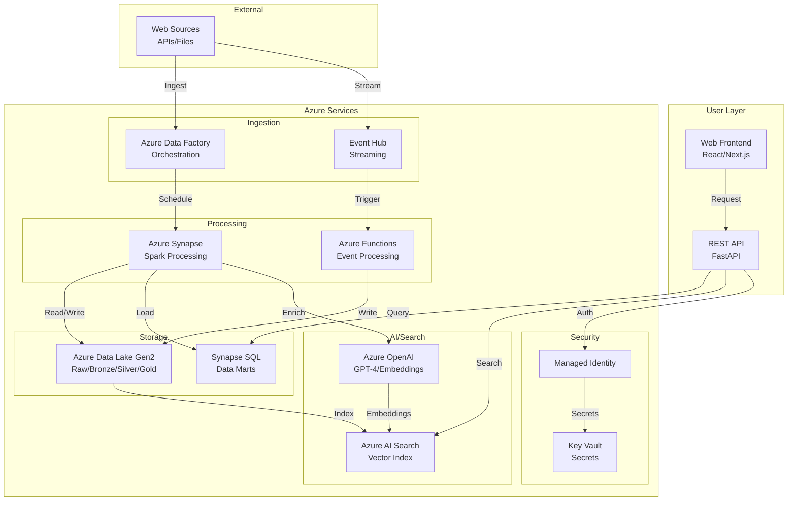
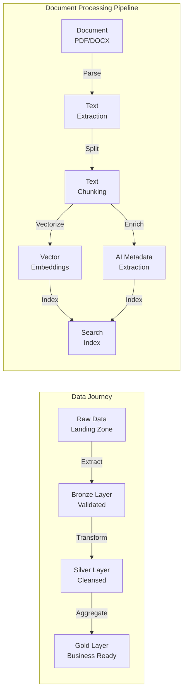
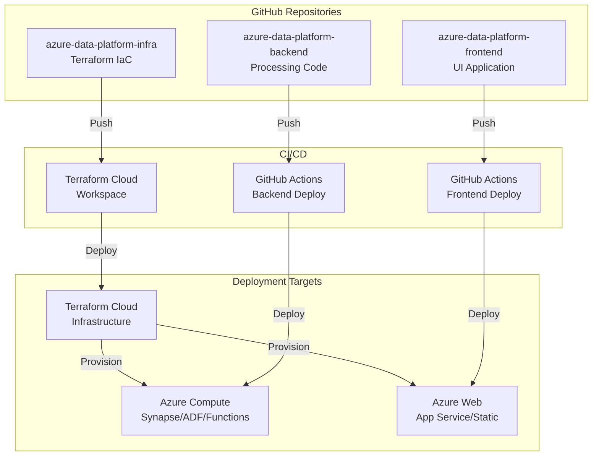
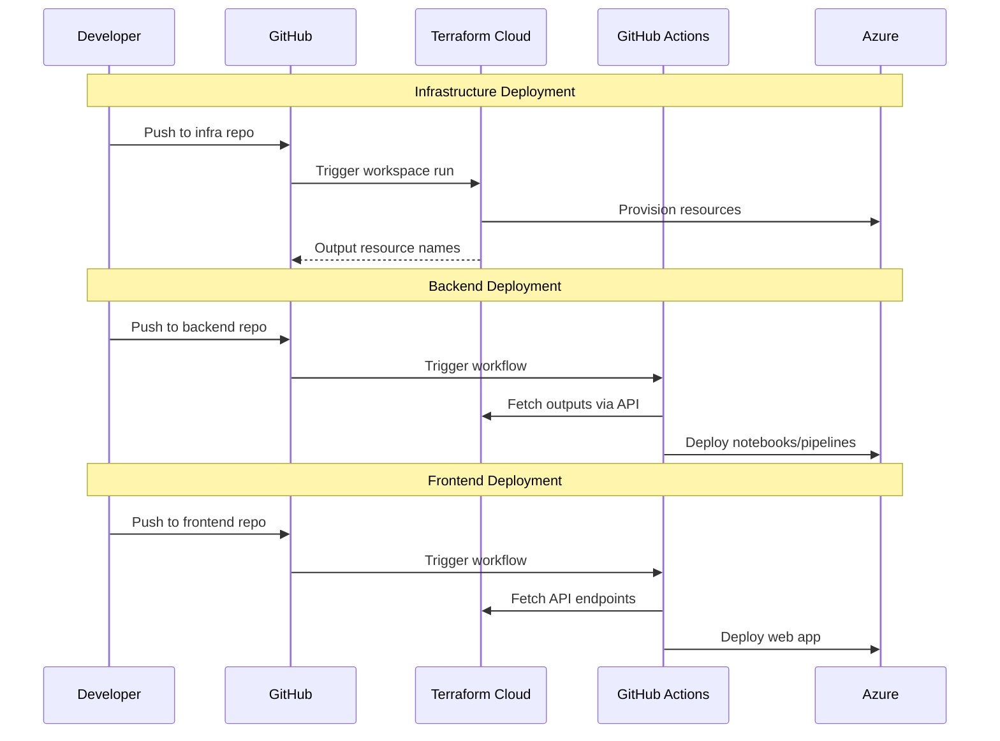

# Azure Data Platform - Architecture Overview

## System Architecture

```mermaid
graph TB
    subgraph "User Layer"
        UI[Web Frontend<br/>React/Next.js]
        API[REST API<br/>FastAPI]
    end
    
    subgraph "Azure Services"
        subgraph "Ingestion"
            ADF[Azure Data Factory<br/>Orchestration]
            EH[Event Hub<br/>Streaming]
        end
        
        subgraph "Processing"
            SYN[Azure Synapse<br/>Spark Processing]
            FUNC[Azure Functions<br/>Event Processing]
        end
        
        subgraph "Storage"
            ADLS[Azure Data Lake Gen2<br/>Raw/Bronze/Silver/Gold]
            SQL[Synapse SQL<br/>Data Marts]
        end
        
        subgraph "AI/Search"
            OAI[Azure OpenAI<br/>GPT-4/Embeddings]
            SRCH[Azure AI Search<br/>Vector Index]
        end
        
        subgraph "Security"
            KV[Key Vault<br/>Secrets]
            ID[Managed Identity]
        end
    end
    
    subgraph "External"
        WEB[Web Sources<br/>APIs/Files]
    end
    
    %% Connections
    WEB -->|Ingest| ADF
    WEB -->|Stream| EH
    ADF -->|Schedule| SYN
    EH -->|Trigger| FUNC
    SYN -->|Read/Write| ADLS
    FUNC -->|Write| ADLS
    SYN -->|Load| SQL
    SYN -->|Enrich| OAI
    OAI -->|Embeddings| SRCH
    ADLS -->|Index| SRCH
    API -->|Query| SQL
    API -->|Search| SRCH
    UI -->|Request| API
    API -->|Auth| ID
    ID -->|Secrets| KV
```

## Data Flow Architecture

```mermaid
graph LR
    subgraph "Data Journey"
        RAW[Raw Data<br/>Landing Zone]
        BRONZE[Bronze Layer<br/>Validated]
        SILVER[Silver Layer<br/>Cleansed]
        GOLD[Gold Layer<br/>Business Ready]
    end
    
    subgraph "Document Processing Pipeline"
        DOC[Document<br/>PDF/DOCX]
        TXT[Text<br/>Extraction]
        CHUNK[Text<br/>Chunking]
        EMB[Vector<br/>Embeddings]
        META[AI Metadata<br/>Extraction]
        IDX[Search<br/>Index]
    end
    
    RAW -->|Extract| BRONZE
    BRONZE -->|Transform| SILVER
    SILVER -->|Aggregate| GOLD
    
    DOC -->|Parse| TXT
    TXT -->|Split| CHUNK
    CHUNK -->|Vectorize| EMB
    CHUNK -->|Enrich| META
    EMB -->|Index| IDX
    META -->|Index| IDX
```

## Repository Architecture

```mermaid
graph TB
    subgraph "GitHub Repositories"
        INFRA[azure-data-platform-infra<br/>Terraform IaC]
        BACK[azure-data-platform-backend<br/>Processing Code]
        FRONT[azure-data-platform-frontend<br/>UI Application]
    end
    
    subgraph "Deployment Targets"
        TFC[Terraform Cloud<br/>Infrastructure]
        AZ_COMP[Azure Compute<br/>Synapse/ADF/Functions]
        AZ_WEB[Azure Web<br/>App Service/Static]
    end
    
    subgraph "CI/CD"
        GHA1[GitHub Actions<br/>Backend Deploy]
        GHA2[GitHub Actions<br/>Frontend Deploy]
        TF_PIPE[Terraform Cloud<br/>Workspace]
    end
    
    INFRA -->|Push| TF_PIPE
    TF_PIPE -->|Deploy| TFC
    TFC -->|Provision| AZ_COMP
    TFC -->|Provision| AZ_WEB
    
    BACK -->|Push| GHA1
    GHA1 -->|Deploy| AZ_COMP
    
    FRONT -->|Push| GHA2
    GHA2 -->|Deploy| AZ_WEB
```

## Deployment Flow

```mermaid
sequenceDiagram
    participant Dev as Developer
    participant GH as GitHub
    participant TF as Terraform Cloud
    participant GHA as GitHub Actions
    participant AZ as Azure
    
    Note over Dev,AZ: Infrastructure Deployment
    Dev->>GH: Push to infra repo
    GH->>TF: Trigger workspace run
    TF->>AZ: Provision resources
    TF-->>GH: Output resource names
    
    Note over Dev,AZ: Backend Deployment
    Dev->>GH: Push to backend repo
    GH->>GHA: Trigger workflow
    GHA->>TF: Fetch outputs via API
    GHA->>AZ: Deploy notebooks/pipelines
    
    Note over Dev,AZ: Frontend Deployment
    Dev->>GH: Push to frontend repo
    GH->>GHA: Trigger workflow
    GHA->>TF: Fetch API endpoints
    GHA->>AZ: Deploy web app
```
