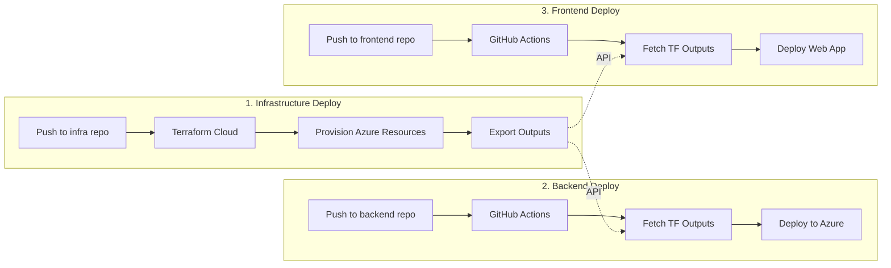

# Azure Data Platform - Multi-Repository Architecture

## Overview

The Azure Data Platform is structured as three independent but integrated repositories, each with its own deployment pipeline and responsibilities.

## Repository Structure

### 1. Infrastructure Repository (`azure-data-platform-infra`)
**Purpose**: Manages all Azure infrastructure using Terraform  
**Deployment**: Terraform Cloud  
**Branches**: `develop` → Dev | `staging` → Stg | `main` → Prod  

### 2. Backend Repository (`azure-data-platform-backend`)
**Purpose**: Data processing, ETL/ELT, AI enrichment  
**Deployment**: GitHub Actions → Azure Services  
**Branches**: `develop` → Dev | `staging` → Stg | `main` → Prod  

### 3. Frontend Repository (`azure-data-platform-frontend`)
**Purpose**: Web interface for search and monitoring  
**Deployment**: GitHub Actions → Azure Static Web Apps/CDN  
**Branches**: `develop` → Dev | `staging` → Stg | `main` → Prod  

## Integration Flow



## Deployment Sequence

### Initial Setup
1. **Infrastructure First**
   - Deploy infrastructure via Terraform Cloud
   - Creates all Azure resources
   - Outputs resource names/endpoints

2. **Backend Second**
   - Fetches infrastructure outputs
   - Deploys notebooks to Synapse
   - Deploys pipelines to ADF
   - Configures search indices

3. **Frontend Last**
   - Fetches API endpoints from infrastructure
   - Builds with environment configuration
   - Deploys to hosting service

## Cross-Repository Communication

### Infrastructure → Backend/Frontend
Infrastructure outputs are consumed via Terraform Cloud API:
```bash
curl -H "Authorization: Bearer $TF_API_TOKEN" \
  "https://app.terraform.io/api/v2/workspaces/$WORKSPACE_ID/current-state-version?include=outputs"
```

Key outputs:
- `synapse_workspace_name`
- `data_factory_name`
- `storage_account_name`
- `search_service_name`
- `api_endpoint`
- `key_vault_name`

### Backend → Frontend
Backend provides REST API endpoints that frontend consumes:
- `/api/search` - Document search
- `/api/documents` - Document operations
- `/api/metrics` - Processing metrics
- `/api/pipeline/status` - Pipeline monitoring

## Environment Management

### Development Flow
```
Feature Branch → PR → Review → Merge to develop → Auto Deploy to Dev
```

### Staging Flow
```
develop → staging branch → Auto Deploy to Staging → Testing
```

### Production Flow
```
staging → main branch → Manual Approval → Deploy to Production
```

## Security & Access

### Repository Secrets

**All Repositories:**
- `AZURE_CREDENTIALS` - Service principal for Azure
- `TF_API_TOKEN` - Terraform Cloud API access

**Infrastructure Repository:**
- Managed in Terraform Cloud workspace variables
- `ARM_CLIENT_ID`, `ARM_CLIENT_SECRET`, `ARM_SUBSCRIPTION_ID`, `ARM_TENANT_ID`

**Backend Repository:**
- `TF_WORKSPACE_DEV`, `TF_WORKSPACE_STG`, `TF_WORKSPACE_PROD`
- `SYNAPSE_WORKSPACE_SECRET`

**Frontend Repository:**
- `AZURE_STATIC_WEB_APPS_API_TOKEN_*`
- `APP_INSIGHTS_KEY_*`
- `AZURE_AD_CLIENT_ID`, `AZURE_AD_TENANT_ID`

### Access Control

**Infrastructure:**
- Terraform Cloud workspace permissions
- Require approval for production

**Backend/Frontend:**
- GitHub environment protection rules
- Required reviewers for staging/production
- Branch protection on main

## Monitoring & Observability

### Infrastructure Monitoring
- Terraform Cloud run history
- Azure Monitor for resource health
- Cost Management alerts

### Backend Monitoring
- Synapse Analytics monitoring
- ADF pipeline runs
- Application Insights for functions
- Data quality metrics

### Frontend Monitoring
- Application Insights for web app
- Real User Monitoring (RUM)
- Performance metrics (Core Web Vitals)
- Error tracking

## Rollback Procedures

### Infrastructure Rollback
```bash
# In Terraform Cloud UI
# Select previous state version
# Click "Rollback to this version"
```

### Backend Rollback
```bash
# Revert to previous release
git revert <commit>
git push origin <branch>
# OR use GitHub release rollback
```

### Frontend Rollback
```bash
# Deploy previous version
git checkout <previous-tag>
npm run build
npm run deploy:<env>
```

## Local Development Setup

### Prerequisites
1. Clone all three repositories
2. Install tools:
   - Terraform >= 1.5
   - Python >= 3.9
   - Node.js >= 18
   - Azure CLI

### Environment Setup
```bash
# Infrastructure
cd azure-data-platform-infra
terraform init

# Backend
cd azure-data-platform-backend
python -m venv venv
source venv/bin/activate
pip install -r requirements.txt

# Frontend
cd azure-data-platform-frontend
npm install
cp .env.example .env.local
```

### Running Locally
```bash
# Backend API (if needed)
cd backend
python -m uvicorn api.main:app --reload

# Frontend
cd frontend
npm run dev
```

## CI/CD Pipelines

### Test Automation
- **Unit Tests**: Run on every PR
- **Integration Tests**: Run on merge to develop
- **E2E Tests**: Run on deployment to staging
- **Performance Tests**: Weekly scheduled runs

### Deployment Gates
- **Dev**: Automatic on merge
- **Staging**: Automatic with tests
- **Production**: Manual approval + smoke tests

## Disaster Recovery

### Backup Strategy
- **Infrastructure**: Terraform state in cloud
- **Data**: Azure backup policies
- **Code**: Git repository + releases

### Recovery Time Objectives
- **Dev**: 2 hours
- **Staging**: 4 hours  
- **Production**: 1 hour

## Documentation

Each repository maintains its own docs:
- `/README.md` - Quick start guide
- `/docs/` - Detailed documentation
- `/CONTRIBUTING.md` - Contribution guidelines
- `/CHANGELOG.md` - Release history

## Support & Escalation

1. **GitHub Issues** - Bug reports and features
2. **Slack Channel** - #data-platform-support
3. **On-Call** - PagerDuty rotation
4. **Escalation** - Technical Lead → Manager → Director
